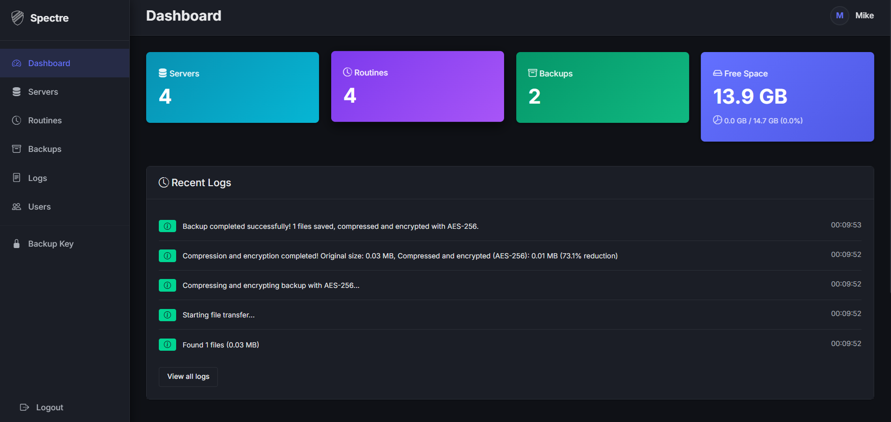
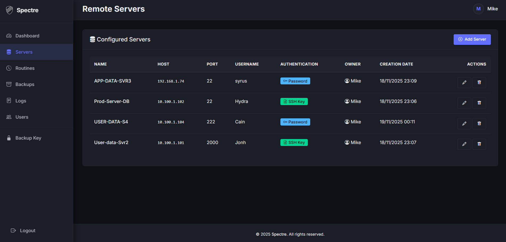
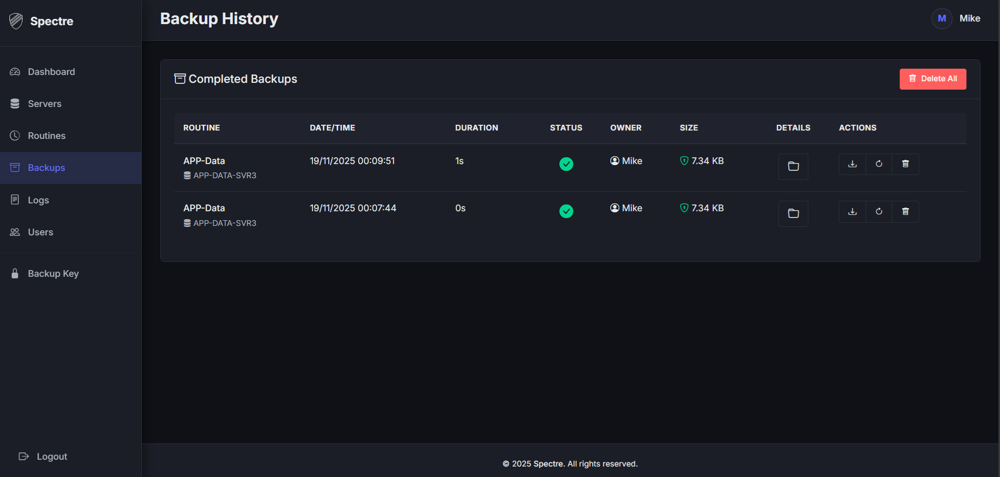
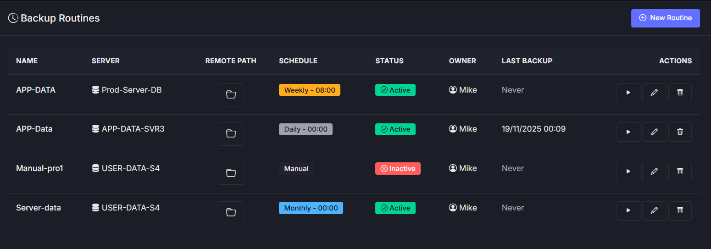

# Spectre - Automated Backup Management System

<p align="center">
  
</p>

<p align="center">
  <strong>Enterprise-grade backup management with advanced security and multi-user support</strong>
</p>

<p align="center">
  
  
  
  
</p>

---

## 🚀 Overview

**Spectre** is a secure, web-based backup management system that enables organizations to centrally manage automated backups of remote servers via SSH/SFTP. Built with Flask and designed for production environments, it features AES-256 encryption, two-factor authentication, role-based access control, and comprehensive audit logging.



## ✨ Key Features

### 🔐 Security First
- **AES-256 Encrypted Backups** - Password-protected ZIP archives
- **Two-Factor Authentication** - TOTP-based (Google Authenticator, Authy)
- **Encrypted Credential Storage** - Fernet encryption for server passwords and SSH keys
- **PBKDF2-SHA256 Hashing** - 600,000 iterations (OWASP 2023 standard)
- **Complete Audit Logging** - Track all user actions and system events
- **HTTPS Enforcement** - Let's Encrypt integration or self-signed certificates

### 📊 Backup Management
- **Flexible Scheduling** - Daily, weekly, or manual execution
- **Automated Retention** - Configurable cleanup policies
- **One-Click Restoration** - Restore backups directly to source servers
- **Real-time Monitoring** - Track backup status and disk usage
- **Multi-Server Support** - Manage unlimited remote servers

### 👥 Multi-User Architecture
- **Role-Based Access Control** - Admin and User roles
- **Complete Tenant Isolation** - Users only see their own resources
- **User Management** - Lifecycle management with audit trails
- **Unique Backup Keys** - Each user receives encrypted backup password



## 🛠️ Technology Stack

- **Backend**: Flask 3.0, SQLAlchemy, Flask-Login
- **Security**: cryptography (Fernet), pyotp, pyzipper
- **Remote Access**: Paramiko (SSH/SFTP)
- **Scheduling**: APScheduler with CronTrigger
- **Production**: Gunicorn, Nginx, Systemd, Fail2Ban
- **Database**: SQLite (default), PostgreSQL/MySQL compatible

## 📦 Quick Start

### Prerequisites
- Python 3.10+
- Ubuntu 20.04+ or Debian 11+ (for production deployment)
- SSH access to remote servers

### Development Installation

```bash
# Clone repository
git clone https://github.com/yourusername/spectre.git
cd spectre

# Create virtual environment
python3 -m venv venv
source venv/bin/activate  # On Windows: venv\Scripts\activate

# Install dependencies
pip install -r requirements.txt

# Generate encryption keys
python3 -c "import secrets; print('SECRET_KEY=' + secrets.token_hex(32))" >> .env
python3 -c "from cryptography.fernet import Fernet; print('ENCRYPTION_KEY=' + Fernet.generate_key().decode())" >> .env

# Initialize database
python3 wsgi.py
```

Access the application at `http://localhost:5000`



## 🚀 Production Deployment

Spectre includes an automated installation script for production environments:

```bash
# Run as root
sudo ./install.sh
```

The installer will:
- ✅ Install system dependencies (Python, Nginx, Certbot, Fail2Ban)
- ✅ Configure SSL certificates (Let's Encrypt or self-signed)
- ✅ Set up Nginx reverse proxy with security headers
- ✅ Create systemd service with auto-restart
- ✅ Configure Fail2Ban for brute-force protection
- ✅ Initialize database and create admin user

**Post-Installation:**
- Access via `https://your-domain.com`
- Enable 2FA for all users (recommended)
- Configure backup retention policies
- Add remote servers and create routines

## 📖 Usage

### 1. Add Remote Servers
Configure servers with SSH credentials (password or key-based authentication).

### 2. Create Backup Routines
Define what to backup, when, and retention policies.

### 3. Monitor & Restore
Track backup execution in real-time and restore with one click.



## 🔒 Security Features

- **Input Validation** - Comprehensive sanitization for all user inputs
- **Path Traversal Prevention** - Secure file path validation
- **IDOR Protection** - Authorization checks on all endpoints
- **Session Security** - Automatic regeneration and secure cookies
- **Timing Attack Prevention** - Constant-time comparisons
- **HTTPS Only** - Automatic HTTP → HTTPS redirection
- **Security Headers** - CSP, HSTS, X-Frame-Options, X-Content-Type-Options

## 📊 System Requirements

### Minimum
- 2 CPU cores
- 2GB RAM
- 20GB storage (+ backup space)

### Recommended
- 4 CPU cores
- 4GB RAM
- SSD storage for database
- Separate volume for backups

## 🤝 Contributing

Contributions are welcome! Please follow these guidelines:

1. Fork the repository
2. Create a feature branch (`git checkout -b feature/amazing-feature`)
3. Commit your changes (`git commit -m 'Add amazing feature'`)
4. Push to the branch (`git push origin feature/amazing-feature`)
5. Open a Pull Request

## 📝 License

This project is licensed under the MIT License - see the [LICENSE](LICENSE) file for details.

## 🙏 Acknowledgments

- Flask framework and community
- Paramiko for SSH/SFTP implementation
- APScheduler for job scheduling
- All contributors and users

## 📧 Support

- **Documentation**: [Wiki](https://github.com/yourusername/spectre/wiki)
- **Issues**: [GitHub Issues](https://github.com/yourusername/spectre/issues)
- **Security**: Report vulnerabilities via email to security@yourdomain.com

---

<p align="center">
  Made with ❤️ by the Spectre Team
</p>
